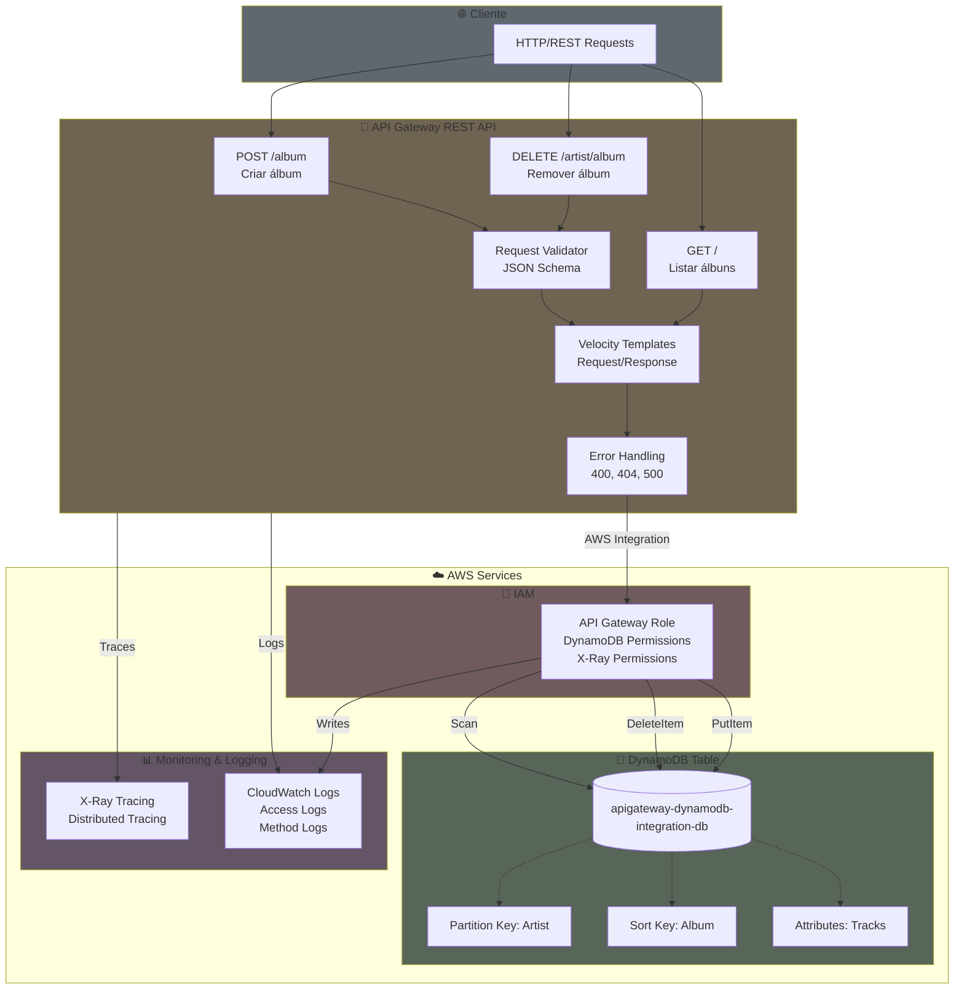

# API Gateway - DynamoDB Integration CDK

Um projeto AWS CDK (Cloud Development Kit) que cria uma API REST serverless integrada diretamente com DynamoDB usando API Gateway. Este projeto demonstra como criar uma API REST sem necessidade de funções Lambda, utilizando integrações nativas do API Gateway com DynamoDB.

## 📋 Índice

- [Visão Geral](#visão-geral)
- [Arquitetura](#arquitetura)
- [Funcionalidades](#funcionalidades)
- [Pré-requisitos](#pré-requisitos)
- [Instalação](#instalação)
- [Uso](#uso)
- [Estrutura do Projeto](#estrutura-do-projeto)
- [Endpoints da API](#endpoints-da-api)
- [Exemplos de Uso](#exemplos-de-uso)
- [Testes](#testes)
- [Deploy](#deploy)
- [Clean Code](#clean-code)
- [Tecnologias Utilizadas](#tecnologias-utilizadas)

## 🎯 Visão Geral

Este projeto implementa uma API REST para gerenciar uma coleção de álbuns musicais. A solução utiliza:

- **API Gateway REST API** para expor os endpoints
- **DynamoDB** como banco de dados NoSQL
- **Integração direta** entre API Gateway e DynamoDB (sem Lambda)
- **Velocity Templates** para transformação de requisições/respostas
- **Request Validation** para validar dados de entrada
- **CloudWatch Logs** para logging e monitoramento
- **AWS X-Ray** para rastreamento distribuído

## 🏗️ Arquitetura


    
## ✨ Funcionalidades

- ✅ **CRUD completo** para álbuns musicais
- ✅ **Validação de requisições** com JSON Schema
- ✅ **Transformação de dados** usando Velocity Templates
- ✅ **Tratamento de erros** padronizado (400, 404, 500)
- ✅ **Logging completo** em CloudWatch Logs
- ✅ **Tracing distribuído** com AWS X-Ray
- ✅ **Infraestrutura como Código** com AWS CDK
- ✅ **Testes automatizados** abrangentes

## 📦 Pré-requisitos

- **Node.js** >= 18.x
- **npm** >= 9.x
- **AWS CLI** configurado com credenciais válidas
- **AWS CDK CLI** instalado globalmente:
  ```bash
  npm install -g aws-cdk
  ```
- **Conta AWS** com permissões adequadas para criar recursos

## 🚀 Instalação

1. Clone o repositório:
   ```bash
   git clone <repository-url>
   cd apigateway-dynamodb-integration-cdk
   ```

2. Instale as dependências:
   ```bash
   npm install
   ```

3. Compile o projeto TypeScript:
   ```bash
   npm run build
   ```

## 💻 Uso

### Comandos Disponíveis

```bash
# Executar testes
npm test

# Sintetizar CloudFormation template
npx cdk synth

# Visualizar diferenças antes do deploy
npx cdk diff

# Fazer deploy da stack
npx cdk deploy

# Destruir a stack
npx cdk destroy
```

## 📁 Estrutura do Projeto

```
apigateway-dynamodb-integration-cdk/
├── bin/
│   └── apigateway-dynamodb-integration-cdk.ts  # Entry point
├── lib/
│   └── apigateway-dynamodb-integration-cdk-stack.ts  # Stack principal
├── test/
│   └── apigateway-dynamodb-integration-cdk.test.ts   # Testes
├── cdk.json                                         # Configuração CDK
├── tsconfig.json                                    # Configuração TypeScript
├── jest.config.js                                   # Configuração Jest
├── package.json                                     # Dependências
└── README.md                                        # Este arquivo
```

## 🔌 Endpoints da API

### POST /album

Cria um novo álbum na coleção.

**Request Body:**
```json
{
  "artist": "Nome do Artista",
  "album": "Nome do Álbum",
  "tracks": [
    {
      "title": "Nome da Faixa",
      "length": "3:45"
    }
  ]
}
```

**Campos obrigatórios:** `artist`, `album`  
**Campos opcionais:** `tracks`

**Response:**
- `204 No Content` - Sucesso
- `400 Bad Request` - Dados inválidos
- `500 Internal Server Error` - Erro do servidor

### DELETE /{artist}/{album}

Remove um álbum da coleção.

**Path Parameters:**
- `artist` (obrigatório) - Nome do artista
- `album` (obrigatório) - Nome do álbum

**Response:**
- `200 OK` - Álbum removido com sucesso
  ```json
  {
    "artist": "Nome do Artista",
    "album": "Nome do Álbum"
  }
  ```
- `404 Not Found` - Álbum não encontrado
- `400 Bad Request` - Parâmetros inválidos
- `500 Internal Server Error` - Erro do servidor

### GET /

Lista todos os álbuns na coleção.

**Response:**
- `200 OK` - Lista de álbuns
  ```json
  [
    {
      "artist": "Nome do Artista",
      "album": "Nome do Álbum",
      "tracks": [
        {
          "title": "Nome da Faixa",
          "length": "3:45"
        }
      ]
    }
  ]
  ```
- `400 Bad Request` - Erro na requisição
- `500 Internal Server Error` - Erro do servidor

## 📝 Exemplos de Uso

### Criar um álbum

```bash
curl -X POST https://<api-id>.execute-api.<region>.amazonaws.com/prod/album \
  -H "Content-Type: application/json" \
  -d '{
    "artist": "Pink Floyd",
    "album": "The Dark Side of the Moon",
    "tracks": [
      {
        "title": "Speak to Me",
        "length": "1:13"
      },
      {
        "title": "Breathe",
        "length": "2:43"
      }
    ]
  }'
```

### Listar todos os álbuns

```bash
curl -X GET https://<api-id>.execute-api.<region>.amazonaws.com/prod/
```

### Remover um álbum

```bash
curl -X DELETE https://<api-id>.execute-api.<region>.amazonaws.com/prod/Pink%20Floyd/The%20Dark%20Side%20of%20the%20Moon
```

## 🧪 Testes

O projeto inclui testes abrangentes que verificam:

- ✅ **DynamoDB Table**: Criação da tabela com chaves corretas
- ✅ **API Gateway**: Configuração da REST API com logging e tracing
- ✅ **IAM Roles**: Permissões para API Gateway acessar DynamoDB e X-Ray
- ✅ **Endpoints**: POST `/album`, DELETE `/{artist}/{album}`, e GET `/`
- ✅ **Templates de Integração**: Velocity templates para transformação
- ✅ **Validação de Requisições**: Modelos e validadores
- ✅ **Tratamento de Erros**: Templates de resposta de erro (400 e 500)

### Executar Testes

```bash
# Executar todos os testes
npm test

# Executar testes em modo watch
npm test -- --watch

# Executar testes com coverage
npm test -- --coverage
```

## 🚢 Deploy

### Primeiro Deploy

1. Bootstrapping do CDK (apenas na primeira vez):
   ```bash
   npx cdk bootstrap
   ```

2. Sintetizar o template CloudFormation:
   ```bash
   npx cdk synth
   ```

3. Visualizar mudanças:
   ```bash
   npx cdk diff
   ```

4. Fazer deploy:
   ```bash
   npx cdk deploy
   ```

### Atualizações

Para atualizar a infraestrutura após mudanças:

```bash
npm run build
npx cdk diff
npx cdk deploy
```

### Remover a Stack

Para remover todos os recursos criados:

```bash
npx cdk destroy
```

⚠️ **Atenção**: A tabela DynamoDB tem `RemovalPolicy.DESTROY`, então será **permanentemente deletada** quando a stack for destruída.

## 🎨 Clean Code

O projeto segue princípios de Clean Code:

- ✅ **Constantes centralizadas** - Valores mágicos extraídos para interface `Constants`
- ✅ **Métodos pequenos e focados** - Cada método tem uma única responsabilidade
- ✅ **Separação de responsabilidades** - Criação de recursos separada da configuração
- ✅ **Eliminação de duplicação** - Templates de erro compartilhados
- ✅ **Nomes descritivos** - Código autoexplicativo
- ✅ **Tipos explícitos** - TypeScript com tipos bem definidos
- ✅ **Organização lógica** - Estrutura clara e fácil de navegar

### Estrutura do Código

```typescript
// Métodos privados organizados por responsabilidade:
- createDynamoDBTable()           // Criação de recursos base
- createRestApi()                 
- createApiGatewayRole()          
- createRequestValidator()        

- setupPostAlbumEndpoint()        // Configuração de endpoints
- setupDeleteAlbumEndpoint()      
- setupGetAllAlbumsEndpoint()     

- buildPostRequestTemplate()      // Templates de integração
- buildDeleteRequestTemplate()    
- buildDeleteResponseTemplate()   
- buildGetAllAlbumsResponseTemplate()

- createErrorIntegrationResponses() // Respostas de erro compartilhadas
```

## 🛠️ Tecnologias Utilizadas

- **AWS CDK** - Framework de IaC
- **TypeScript** - Linguagem de programação
- **Jest** - Framework de testes
- **AWS API Gateway** - Serviço de API
- **Amazon DynamoDB** - Banco de dados NoSQL
- **AWS CloudWatch Logs** - Serviço de logging
- **AWS X-Ray** - Rastreamento distribuído
- **AWS IAM** - Gerenciamento de identidade e acesso
- **Velocity Template Language** - Transformação de dados

## 📚 Recursos Adicionais

- [Documentação AWS CDK](https://docs.aws.amazon.com/cdk/)
- [Documentação API Gateway](https://docs.aws.amazon.com/apigateway/)
- [Documentação DynamoDB](https://docs.aws.amazon.com/dynamodb/)
- [Velocity Template Language Reference](https://velocity.apache.org/engine/1.7/vtl-reference.html)

## 📄 Licença

Este projeto é um exemplo educacional. Sinta-se livre para usá-lo e modificá-lo conforme necessário.

---

**Desenvolvido com ❤️ usando AWS CDK**
